# Puesta en Producción Segura

## Tarea 02: Análisis de vulnerabilidades sobre problemas de configuración a nivel de seguridad en entornos web (OWASP A05)

### INDICE

- INTRODUCCIÓN
- ESCENARIO 1: APACHE
  - ¿Qué es Apache?
  - Análisis del escenario
- ESCENARIO 2: PHP
  - ¿Qué es PHP?
  - Análisis del escenario
- ESCENARIO 3: NGINX
  - ¿Qué es Nginx?
  - Análisis del escenario
- BIBLIOGRAFÍA

#### <u>INTRODUCCIÓN</u>

En este documento contiene unos análisis de las vulnerabilidades relacionadas con la mala configuración, a nivel de seguridad, de las aplicaciones utilizadas en entornos web según la documentación [OWASP A05 - Security Misconfiguration](https://owasp.org/Top10/A05_2021-Security_Misconfiguration/). Comentamos tres escenarios: Apache, PHP y Nginx.

#### <u>ESCENARIO 1: APACHE</u>

##### ¿Qué es Apache?

Es un software de servidor web de código abierto, multiplataforma y gratuito. Es el responsable de atender las solicitudes de los clientes cuando quieren consultar una URL. Está atento a las solicitudes, que llegan mediante el protocolo HTTP y se encarga de enviar las respuestas a los clientes.

#####  Análisis del escenario

Utilizamos un contenedor de Docker que se llama *escenario01* basado en sistema operativo Linux Debian con un mapeo del puerto del equipo que tenemos instalado del Docker con un puerto del contenedor, lo lanzamos y iniciará una sesión de bash.

```bash
ruben@rudebian:~$ docker run -it --name escenario01 -p 8080:80 --cap-add=ALL -v /tmp/.X11-unix:/tmp/.X11-unix --env DISPLAY=$DISPLAY --hostname=escenario01 debian bash
```

Actualizamos los repositorios de Debian, ejecutamos las actualizaciones pendientes, instalamos el servicio *apache* y lo arrancamos.

```bash
root@escenario01:/# apt update
root@escenario01:/# apt -y full-upgrade
root@escenario01:/# apt install -y apache2
root@escenario01:/# service apache2 start
```

Comprobamos si arranca correctamente el servicio *apache*, para ello abrimos el navegador del equipo e introducimos en la barra de navegación la dirección *http://localhost:8080*.

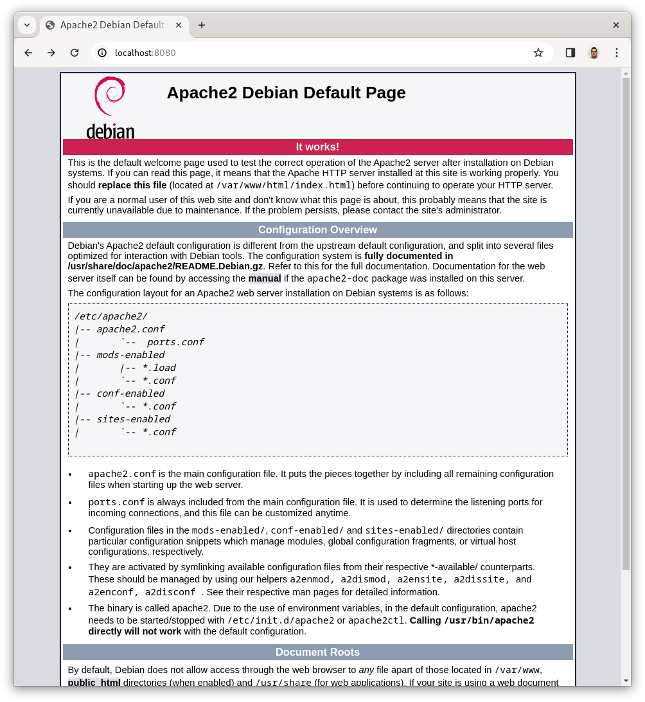

Vamos acceder al directorio *html* que está en la ruta */var/www/*, creamos una carpeta llamada *prueba* y dentro de ella dos ficheros *hola* y *adios*. Suponemos que estos archivos contienen información confidencial, por ejemplo, credenciales (usuario y contraseña).

```bash
root@escenario01:/# cd /var/www/html/           
root@escenario01:/var/www/html# mkdir prueba
root@escenario01:/var/www/html# cd prueba/
root@escenario01:/var/www/html/prueba# touch hola
root@escenario01:/var/www/html/prueba# touch adios
```

Ahora, abrimos el navegador web e introducimos en la barra de navegación la dirección *http://locahost:8080/prueba*.

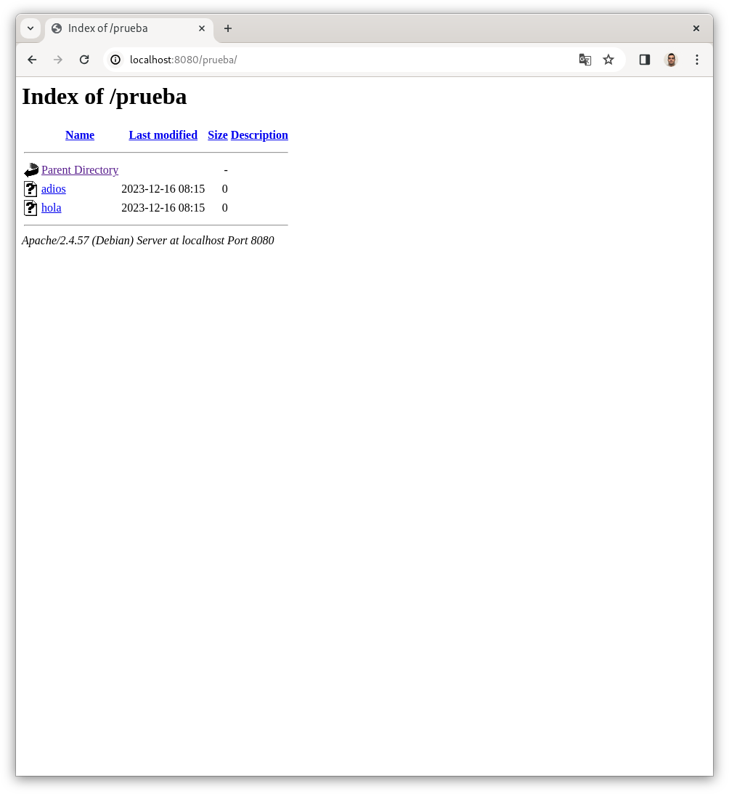


Como podéis ver que revela todos los archivos confidenciales que tiene la carpeta *prueba*. Por tanto, cualquier usuario visitante que conozca la dirección http://localhost:8080/prueba puede descargar estos ficheros.

Para evitar que muestre el contenido de la dicha carpeta, vamos a modificar el archivo de la configuración que se llama *apache2.conf*.

Primero instalamos el editor nano y luego abrimos el archivo *apache2.conf* que está en la ruta */etc/apache2/*.

```bash
root@escenario01:/# apt -y install nano
root@escenario01:/# nano /etc/apache2/apache2.conf 
```

Buscamos *<Directory /var/www/>*.

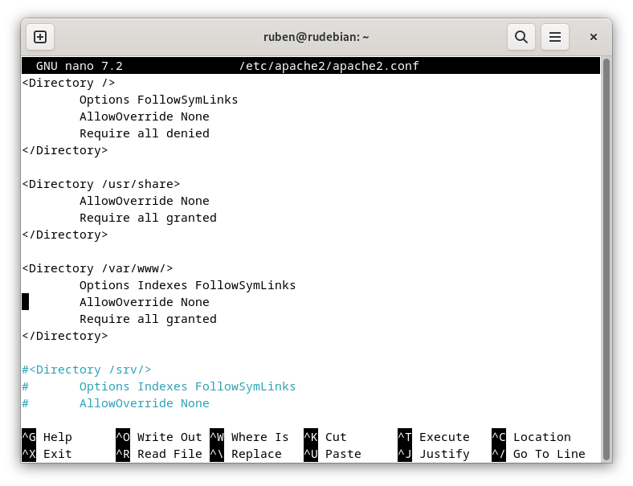

 Cambiamos la directiva *Options* por *-Indexes*

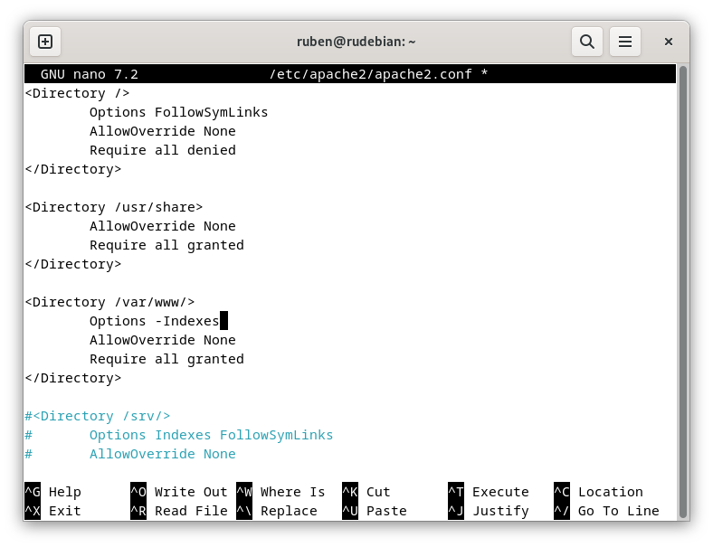

Guardamos el cambio del fichero *apache2.conf*.

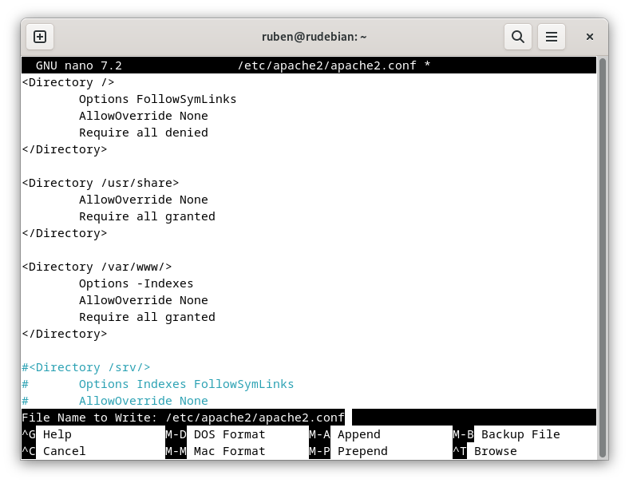

Reiniciamos el servicio *apache*.

```bash
root@escenario01:/# service apache2 restart
```

Ahora, abrimos el navegador web e introducimos en la barra de navegación la dirección *http://locahost:8080/prueba*.

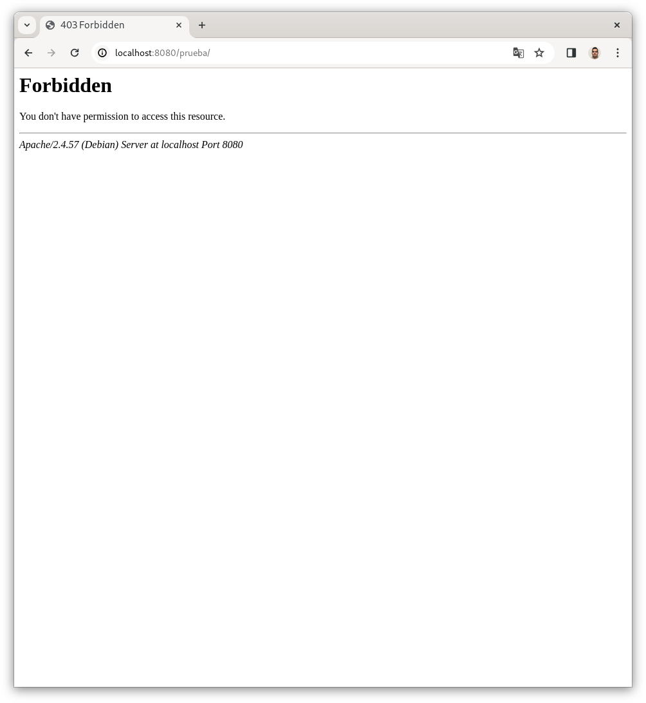

Como podéis ver que muestra un error de prohibido en lugar de mostrar el contenido de la carpeta *prueba*.

Terminamos el análisis de este escenario deteniendo el contenedor *escenario01*.

```bash
ruben@rudebian:~$ docker stop escenario01
```

#### <u>ESCENARIO 2: PHP</u>

##### ¿Qué es PHP?

Es un lenguaje de programación interpretado del lado del servidor y de uso general que se adapta especialmente al desarrollo web.

##### Análisis del escenario

Utilizamos un contenedor de Docker que se llama *escenario02* basado en sistema operativo Linux Debian con un mapeo del puerto del equipo que tenemos instalado del Docker con un puerto del contenedor, lo lanzamos y iniciará una sesión de bash.

```bash
ruben@rudebian:~$ docker run -it --name escenario02 -p 8080:80 --cap-add=ALL -v /tmp/.X11-unix:/tmp/.X11-unix --env DISPLAY=$DISPLAY --hostname=escenario02 debian bash
```

Actualizamos los repositorios de Debian, ejecutamos las actualizaciones pendientes, instalamos Apache, PHP y el módulo libapache2-mod-php que se encarga de configurar automáticamente la integración entre Apache y PHP. Arrancamos Apache.

```bash
root@escenario02:/# apt update
root@escenario02:/# apt -y full-upgrade
root@escenario02:/# apt install -y apache2 php libapache2-mod-php
root@escenario02:/# service apache2 start
```

Comprobamos si arranca correctamente el servicio *apache*, para ello abrimos el navegador del equipo e introducimos en la barra de navegación la dirección *http://localhost:8080*.


También vamos a comprobar si se está ejecutando PHP sobre Apache, para ello escribimos un pequeño script en PHP, para ello instalamos el editor *nano* y creamos un fichero llamado *prueba.php* para que ejecute la función *[phpinfo()](https://www.php.net/manual/es/function.phpinfo.php)*.

```bash
root@escenario02:/# apt -y install nano
root@escenario02:/# nano /var/www/html/prueba.php
```

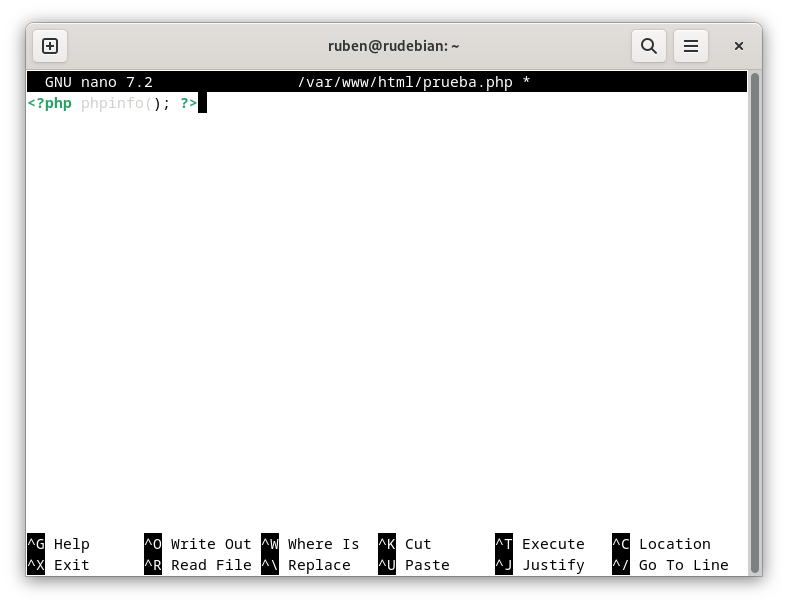

```php
<?php phpinfo(); ?>
```

Guardamos el archivo *prueba.php*

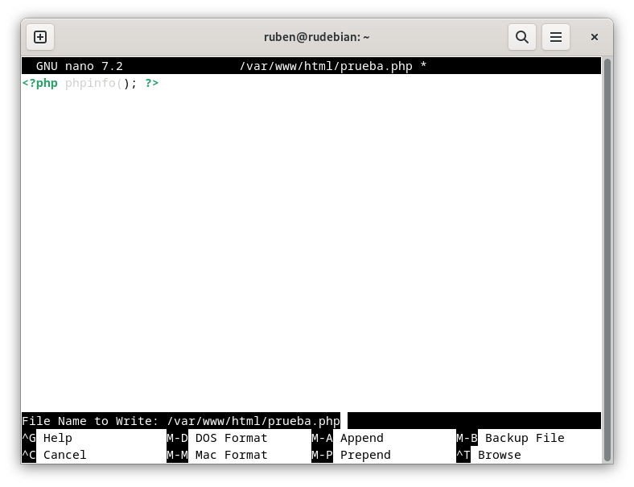

Abrimos el navegador del equipo e introducimos en la barra de navegación la dirección *http://localhost:8080/prueba.php*.

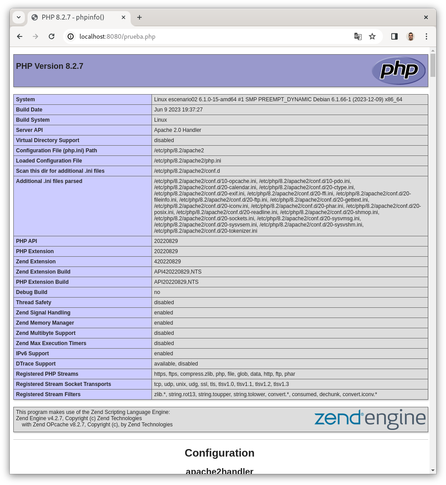

Como podéis ver muestra la información sobre la configuración de PHP, por tanto sabemos PHP se está ejecutando sobre Apache.

Ahora abrimos el fichero *prueba.php*, borramos su contenido e introducimos las funciones *[system()](https://www.php.net/manual/es/function.system.php)*, *[exec()](https://www.php.net/manual/es/function.exec.php)*, *[shell_exec()](https://www.php.net/manual/es/function.shell-exec.php)* y *[passthru()](https://www.php.net/manual/es/function.passthru.php)* para que muestren el contenido de la carpeta */var/www/html/* donde está ubicado dicho fichero.

```bash
root@escenario02:/# nano /var/www/html/prueba.php
```

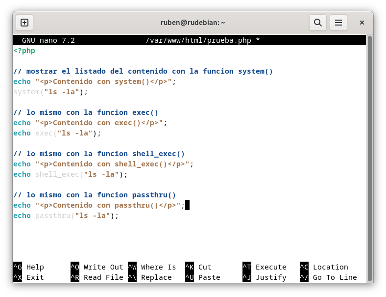

```php
<?php

// mostrar el listado del contenido con la funcion system()
echo "<p>Contenido con system()</p>";
system("ls -la");

// lo mismo con la funcion exec()
echo "<p>Contenido con exec()</p>";
echo exec("ls -la");

// lo mismo con la funcion shell_exec()
echo "<p>Contenido con shell_exec()</p>";
echo shell_exec("ls -la");

// lo mismo con la funcion passthru()
echo "<p>Contenido con passthru()</p>";
echo passthru("ls -la");
```

Guardamos el archivo *prueba.php*.

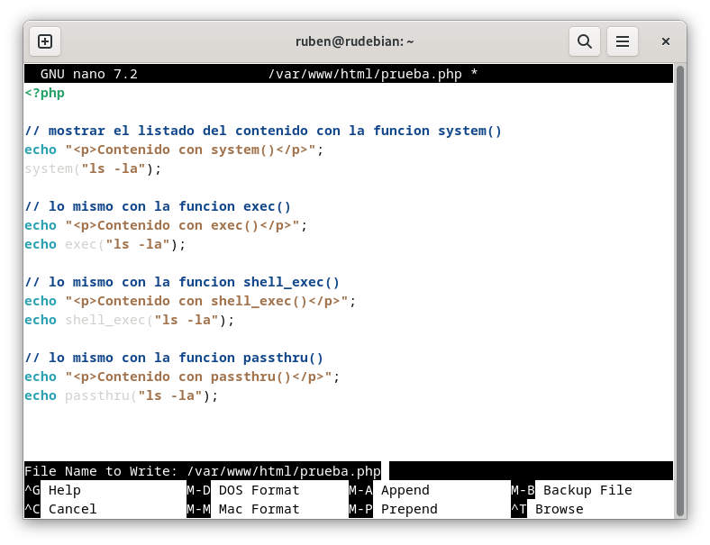

Abrimos el navegador del equipo e introducimos en la barra de navegación la dirección *http://localhost:8080/prueba.php*.

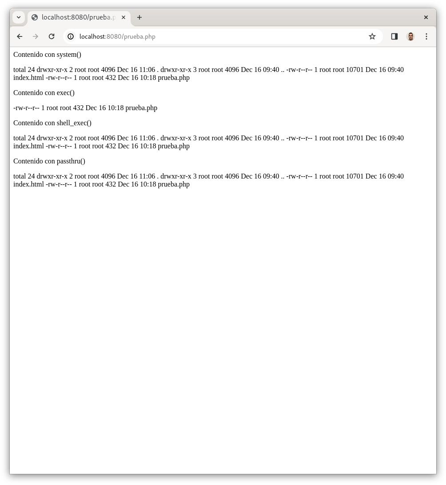

Estas funciones están mostrando el contenido de la carpeta carpeta */var/www/html/*. Esta práctica no es recomendable utilizarlas en un entorno de producción ya que un atacante puede utilizar estas funciones aprovechando alguna vulnerabilidad del equipo de la víctima.

Para prevenir esta situación, vamos a editar el fichero *php.ini*

```bash
root@escenario02:/# nano /etc/php/8.2/apache2/php.ini
```

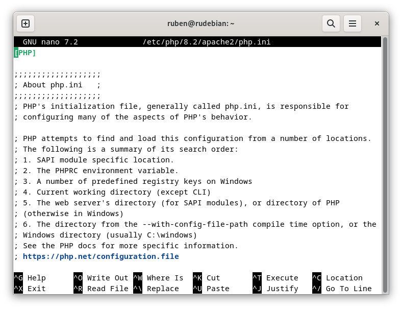

Localizamos la directiva *disabled_functions*.

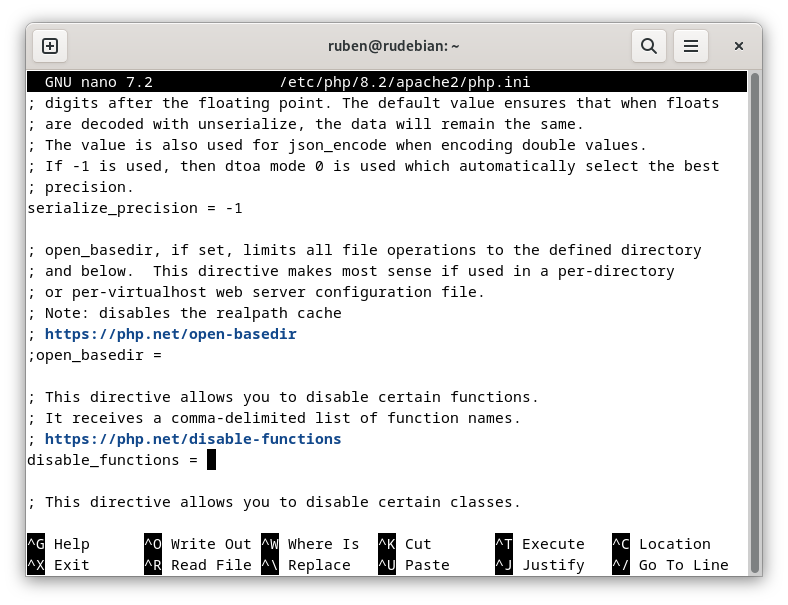

Escribimos las funciones que queremos deshabilitar: *system*, *exec*, *shell_exec* y *passthru*.

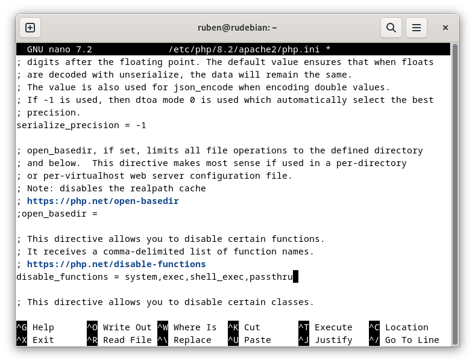

Guardamos el archivo *prueba.php*.

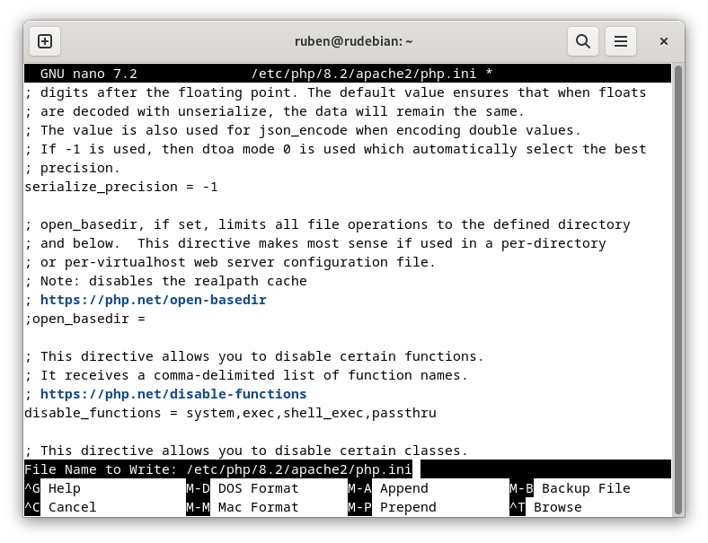

Reiniciamos el servicio *apache*.

```bash
root@escenario02:/# service apache2 restart
```

Abrimos el navegador del equipo e introducimos en la barra de navegación la dirección *http://localhost:8080/prueba.php*.

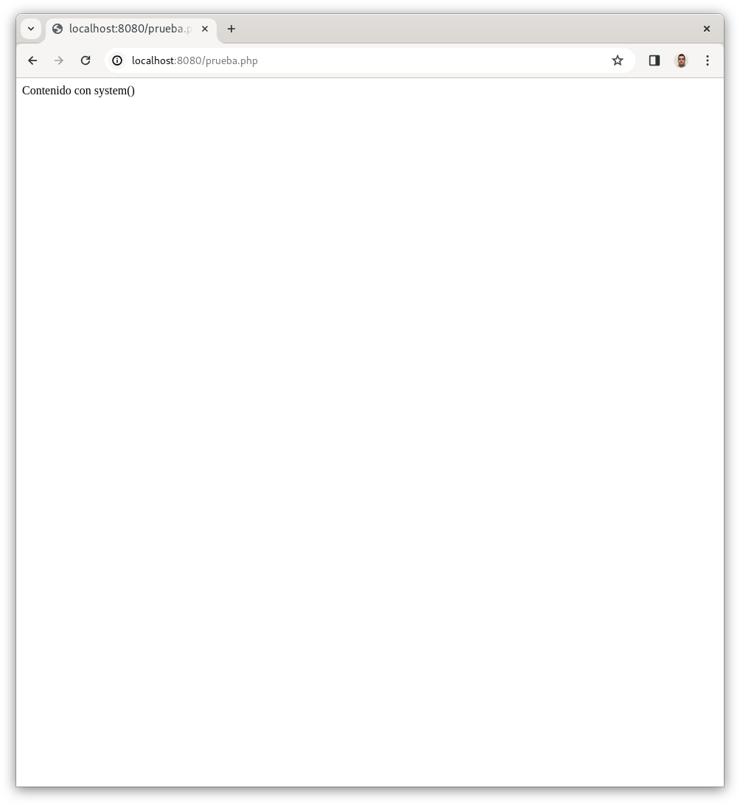

Como podéis ver que ya no muestra el contenido de la carpeta */var/www/html/* en la página *prueba.php*.

Podemos realizar los mismos pasos para deshabilitar la función *phpinfo()*. Simplemente es editar el fichero *php.ini* que está en la ruta */etc/php/8.2/apache2/*, localizar la directiva *disabled_functions*, añadir *phpinfo*, guardar el fichero *php.ini* y reiniciar el servicio *apache*.

Terminamos el análisis de este escenario deteniendo el contenedor *escenario02*.

```bash
ruben@rudebian:~$ docker stop escenario02
```

#### <u>ESCENARIO 3: NGINX</u>

##### ¿Qué es NGINX?

Es un servidor web de código abierto. También se usa como proxy inverso ligero de alto rendimiento, cache de HTTP, y balanceador de carga.

##### Análisis del escenario

Utilizamos un contenedor de Docker que se llama *escenario03* basado en sistema operativo Linux Debian con un mapeo del puerto del equipo que tenemos instalado del Docker con un puerto del contenedor, lo lanzamos y iniciará una sesión de bash.

```bash
ruben@rudebian:~$ docker run -it --name escenario03 -p 8080:80 --cap-add=ALL -v /tmp/.X11-unix:/tmp/.X11-unix --env DISPLAY=$DISPLAY --hostname=escenario03 debian bash
```

Actualizamos los repositorios de Debian, ejecutamos las actualizaciones pendientes, instalamos Nginx y lo arrancamos.

```bash
root@escenario03:/# apt update
root@escenario03:/# apt -y full-upgrade
root@escenario03:/# apt install -y nginx
root@escenario03:/# service nginx start
```

Comprobamos si arranca correctamente el servicio *nginx*, para ello abrimos el navegador del equipo e introducimos en la barra de navegación la dirección *http://localhost:8080*.

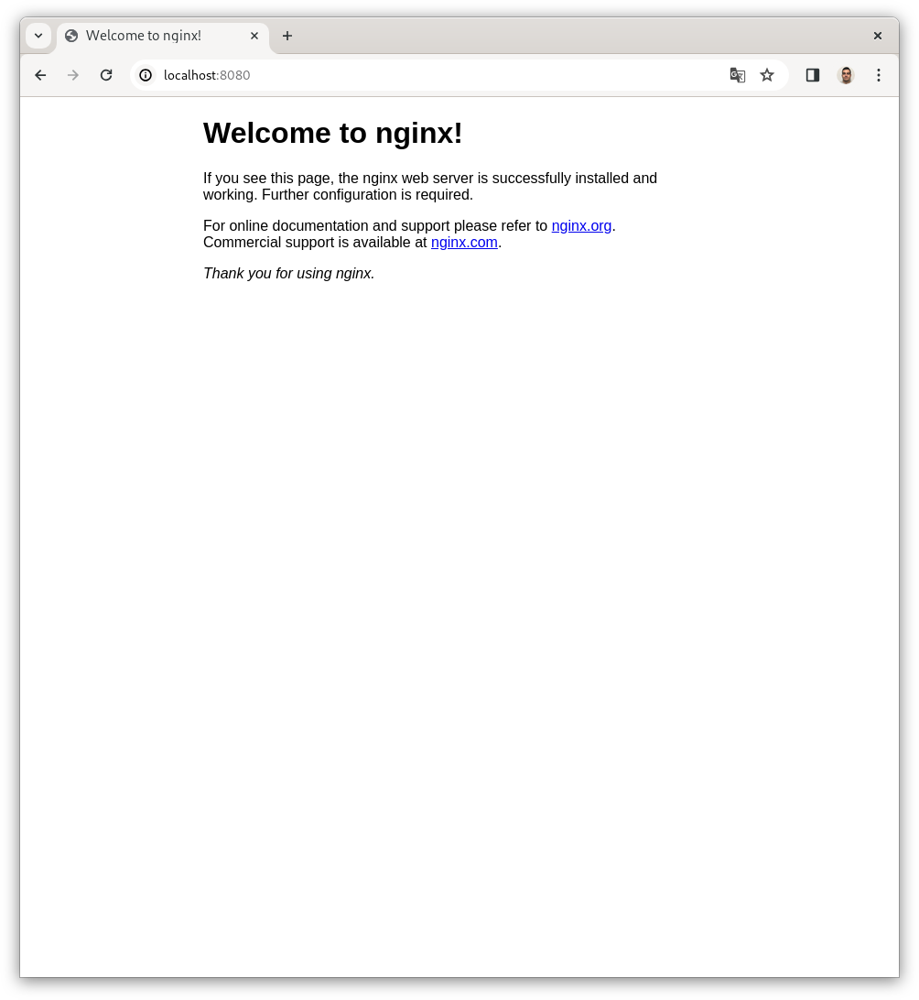

A continuación, queremos saber su versión instalada. Para ello abrimos la consola del equipo del visitante y ejecutamos este comando:

```bash
ruben@rudebian:~$ curl -sI http://localhost:8080 | grep Server:
```

El comando cURL es una herramienta que permite transferir datos hacia o desde un servidor sin interacción del usuario.

Y el resultado es este:


Sabemos que está utilizando la versión *1.22.1*. Conociendo este dato un atacante puede averiguar si esta versión tiene alguna vulnerabilidad.

Para que el servidor Nginx no muestre su versión, tenemos que modificar su configuración.

Primero instalamos el editor *nano* y luego abrimos el archivo *nginx.conf* que está en la ruta */etc/nginx/*.

```bash
root@escenario03:/# apt install -y nano
root@escenario03:/# nano /etc/nginx/nginx.conf 
```

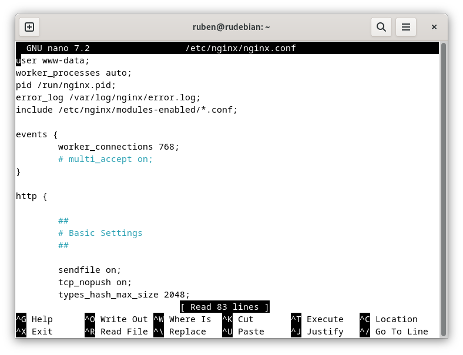

Localizamos la directiva *server_tokens* y vemos aparece comentada.

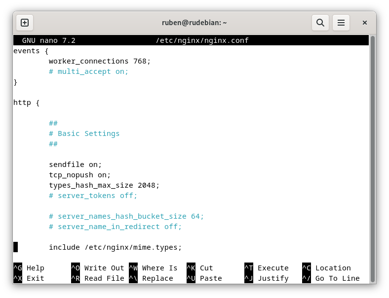

Descomentamos esta directiva.

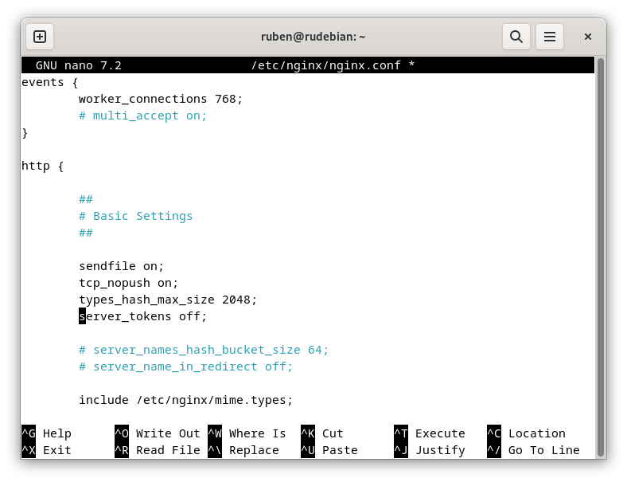

Guardamos el archivo *nginx.conf*

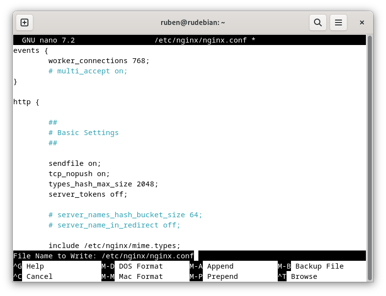

Reiniciamos el servicio *nginx*

```bash
root@escenario03:/# service nginx restart
```

Y comprobamos si el servidor Nginx está mostrando su versión. Para ello abrimos la consola del equipo del visitante y ejecutamos este comando:

```bash
ruben@rudebian:~$ curl -sI http://localhost:8080 | grep Server:
```
Y este es el resultado:

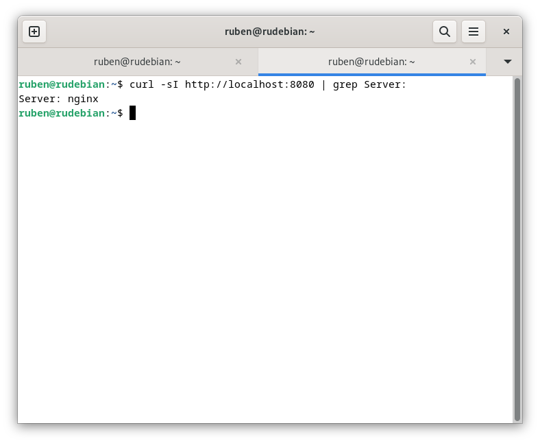

Como podéis ver que ya no muestra su versión instalada.

Terminamos el análisis de este escenario deteniendo el contenedor *escenario03*.

```bash
ruben@rudebian:~$ docker stop escenario03
```

#### <u>BIBLIOGRAFÍA</u>

[Documentación oficial de Docker](https://docs.docker.com/)

[Documentación oficial de Debian](https://www.debian.org/doc/)

[Documentación oficial de Apache](https://httpd.apache.org/docs/2.4/es/)

[Documentación oficial de PHP](https://www.php.net/manual/es/index.php)

[Documentación oficial de Nginx](https://nginx.org/en/docs/)

[Documentación oficial de cURL](https://curl.se/docs/manpage.html)